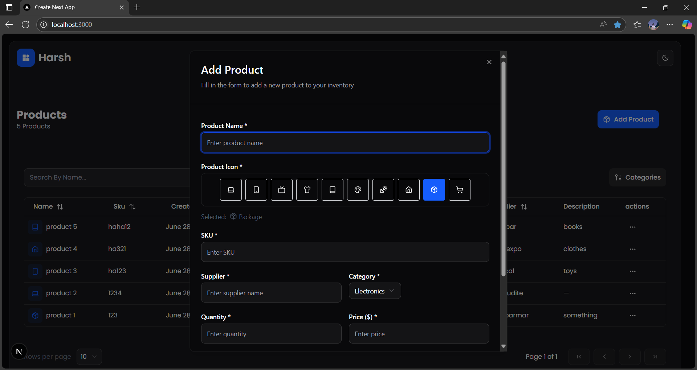

# Product Inventory Management

A full-stack product inventory management system built with **MongoDB** (Mongoose) for the backend, and **React** frontend using **Zustand**, **Tailwind CSS**, **shadcn UI**, **React Hook Form**, **Zod**, and **TanStack Table**.  
It supports adding, editing, deleting, and listing products with unique constraints on product name and SKU, optional description, icon selection, and category filtering.

---

## Technologies Used

- Backend: MongoDB with Mongoose schema modeling and Next.js API routes
- Frontend: React with Zustand state management, Tailwind CSS styling, shadcn UI components, React Hook Form & Zod for validation, TanStack Table for data grid

---

## Pictures





---

## Setup

1. **Clone the repository**

   ```bash
   git clone <repository-url>
   cd <repository-folder>
   ```

2. **Install dependencies**

   ```bash
   npm install
   ```

3. **Setup environment variables**

   ```bash
   MONGODB_URI=your_mongodb_connection_string_here
   ```

4. **Run the development server**

   ```bash
   npm run dev
   ```

5. **Open the app**

   Open your browser and navigate to: [http://localhost:3000](http://localhost:3000) to see the application.

---

## Implementation Overview

### Backend

- **MongoDB** is used as the database to store product data.
- **Mongoose** handles schema definitions and interactions with the database.
- The backend exposes API routes for:
  - `GET` to fetch products with optional filters.
  - `POST` to add new products.
  - `PUT` to update existing products.
  - `DELETE` to remove products.

### Frontend

- Built with **React** and **TypeScript**.
- State management is handled by **Zustand** for simplicity and scalability.
- Styling is done using **Tailwind CSS** and components from **shadcn UI**.
- Forms are managed with **React Hook Form** and validated using **Zod** schemas.
- Data tables are implemented using **TanStack Table** for powerful sorting and filtering.
- Product icons use **lucide-react** icon library.

This setup ensures a modern, scalable, and maintainable full-stack product inventory application.

---

## API Routes

- `GET /api/products`  
  Fetch all products, with optional query parameters for searching by name and filtering by categories.

- `POST /api/products`  
  Add a new product. Requires fields like `name`, `sku`, `supplier`, `category`, `quantityInStock`, `price`, `icon`, and optional `description`.  
  Validates uniqueness of `name` and `sku`.

- `PUT /api/products/:id`  
  Update an existing product by its ID.

- `DELETE /api/products/:id`  
  Remove a product by its ID.

---

## Summary

This project is a full-stack inventory management system that uses:

- **MongoDB** with **Mongoose** for backend data storage and schema enforcement.
- **Next.js API Routes** for backend API endpoints.
- **React** with **Zustand** for efficient state management on the frontend.
- **Tailwind CSS** and **shadcn UI** for sleek, responsive styling.
- **React Hook Form** and **Zod** for robust form handling and validation.
- **TanStack Table** for advanced table features like sorting and filtering.

The app supports product CRUD operations with validation and includes icon selection for products. It’s designed to be scalable, maintainable, and developer-friendly.
